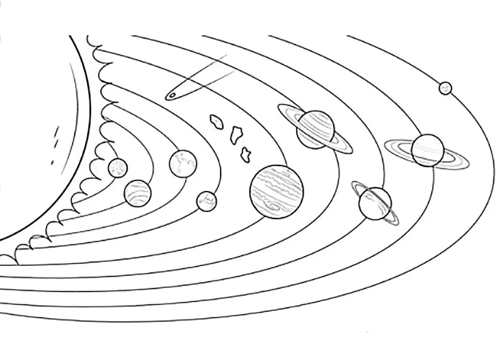
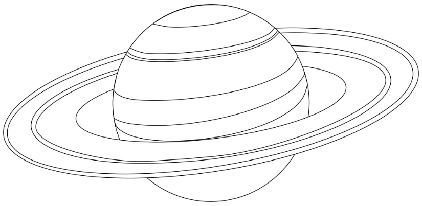

# В Солнечной системе __8__ планет.

__Сатурн__ - шестая  планета от Солнца. 

__Сатурн__ - это газовый гигант, он состоит в основном из водорода и гелия. 

Один год на этой огромной планете составляет почти 30 земных лет. 
Примечательно, что у Сатурна целых 62 спутника, а у Земли всего один.

Я считаю, что __Сатурн__ - самая красивая планета. Очень привлекают внимание кольца вокруг неё. Их можно назвать уникальной достопримечательностью нашей Солнечной системы. В телескоп они выглядят, как диск, но, на самом деле, это множество пыли и камней, которые вращаются с огромной скоростью вокруг планеты. Благодаря развитию космических технологий, Сатурн удалось сфотографировать вблизи, более подробно изучить состав самой планеты и его кольца, и, конечно же, теперь мы можем любоваться фотографиями прекрасного Сатурна.

